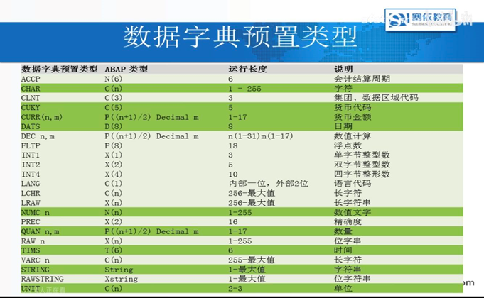

# SAP数据字典

- SE91：新建消息类

  - 消息类型六种：

    - S（成功）显示绿色提示框

    - E（错误）终止程序，红框，所有按钮变成灰色

    - W（警告）

    - I（消息框）弹出提示框

    - A（错误框）弹出框形式的错误消息

    - X（系统错误）DUMP界面

    - 例子： MESSAGE '公司必填!' TYPE 'S' DISPLAY LIKE 'E'.
      一个类型为S展示样式为E的提示消息，就是不会终止程序，但是消息颜色为红色

- Report常用后缀：

  - NO STANDARD PAGE HEADING：不要表头

  - LINE-SIZE：后面跟数字，设置每行最大输出长度

  - LINE-COUNT：设置每隔多少行，换行输出

- WRITE：

  - WRITE：/    ：换行

  - WRITE  AT：(3)2 'zzzzzzzz'：前面空三位输出输出两位。也可以把AT去掉也是一样的效果。

- 事务代码：SE11

- 数据字典

  

  - 数据库表创建

  - 在选择屏幕界面可以设置选择屏幕的字段：设置—>选择字段

  - 数据库对象

    - 透明表(Transparent Table）：在数据库中有对应的物理表

    - 存储表(Pooled Table)

    - 簇表(Cluster Table)

      - 最常用的簇表BSEG

      - 簇表不能用Join

  - 视图 view

    - 数据库视图 Data base View

    - 项目视图 projectionView

    - 维护视图 MaintenanceView

    - 帮助视图 Help View

  - 数据类型 Data Type

    - 数据元素 DataElement:描述-一个字段的用途

    - 结构 structure：为若干个字段组合，在数据库不存在数据记录

    - 表类型 Table Type

  - 类型池 Type Group

  - 域 Domain：描述一个宇段类型和长度等信息

  - 搜索帮助 search Help

  - 查看/维护数据库表主要有以下三个路径

    - SE11—>查看表内容，默认为单条修改

    - SE16N查看表内容，最好不要在此事务代码下进行修改

    - SM30通过批量维护视图查看表内容，需要通过generator生成

  - SM30维护表内容

    - 必须在数据库表中，先进行设置(数据字典：143：00）

    - 界面编号：从0到9999，每个函数组不能重复

    - 设置完毕后，从进入SM30，输入表名，可以维护数据

  - 字段标签是在data element（数据元素）级别关联的 ：se11—>输入数据元素—>选择修改—>点击字段标签

  - 激活的时候的警告缺少用于表的增强类别其实是在附加里面选择增强类别选中无法增强就好了

  - 数据字典里面创建结构，里面的组件就相当于字段，键入方法就相当于参照类型。组件类型就相当于数据元素。结构是不可存储内容的类似数据元素

  - 一般结构会作为表类型的行类型

  - 已经创建过对应的sm30的维护视图的表单，在se16n里面的维护条目自动锁定了

  - 锁对象 Lock object

  - 搜索帮助是在data element（数据元素）级别关联的：  se11—>输入数据元素—>选择修改—>点击详细特性里面有搜索帮助
